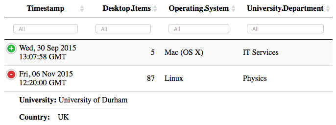

```{r setup, include=FALSE}
knitr::opts_chunk$set(
	echo = TRUE,
	message = FALSE,
	warning = FALSE
)
library(htmltools)
```

<a href="https://github.com/ox-it/OxfordIDN_htmlwidgets/tree/gh-pages/datatable" target="blank">  

</a>


This tutorial demonstrates how to create interactive tables like the one below using the [DT](https://rstudio.github.io/DT/) and [rhandsontable](http://jrowen.github.io/rhandsontable/#introduction) libraries. Note that there are three interactive shiny apps associated with this tutorial:

- [Comparison of DT and rhandsontable](https://livedataoxford.shinyapps.io/htmlwidget_template_datatables)
- [Server-side Pagination](htmlwidget_template_ServerSide-Datatable) 

```{r, echo = FALSE}
library(DT)
library(lubridate)
desktopItems <-
  read.csv(file = "https://ndownloader.figshare.com/files/5360960")
desktopItems$Timestamp <-
  mdy_hms(desktopItems$Timestamp, truncated = 2)
datatable(
  desktopItems,
  filter = 'top',
  extensions = "Responsive",
  rownames = FALSE,
  options = list(pageLength = 5, autoWidth = TRUE)
) %>% formatDate(~ Timestamp, method = "toUTCString")
```

These libraries are useful for visualising almost all rectangular datasets, with support for a variety of data types (dates, strings, URLS, etc).

# Import and Display Data

The data for this template is a .csv file accessed from Figshare [here](https://figshare.com/articles/Investigation_into_the_number_of_desktop_items_on_University_staff_computers_broken_down_by_department_and_operating_system_/3425729) using `read.csv`. 

```{r import_data}
desktopItems <- read.csv(file = "https://ndownloader.figshare.com/files/5360960", stringsAsFactors = FALSE)
knitr::kable(head(desktopItems))
```

The first columns contain dates which need to be converted into a date format, for which we use the `lubridate` library. Unfortunately, the dates are slightly complicated - they are formatted `mm/dd/yyyy hh:mm:ss` but not all entries have seconds. The argument `truncated=2` allows us to handle these dates easily:

```{r}
library(lubridate)
desktopItems$Timestamp <- mdy_hms(desktopItems$Timestamp, truncated = 2)
knitr::kable(head(desktopItems))
```

# DT

The `DT` library binds to the extremely popular JavaScript library, <a href="http://datatables.net">datatables.net</a>. It is pretty much the defacto standard for interactive (responsive) tables, they have the added advantage of being able to paginate data in a variety of ways (including on a server-side engine). Any data.frame can be provided to datatables, and little effort must be put into pre-processing data ready for display in the table.

This data.frame can now be provided to `datatable` from the `DT` library for display, but note the poor formatting of the timestamp

```{r}
library(DT)
datatable(desktopItems)
```

Before beginning to format the columns of the datatable, it is useful to remove the `rownames` as they are typically not that useful for users:

```{r}
datatable(desktopItems,
          rownames = FALSE)
```


## Column Formatting

There are a number of utility functions for formatting columns:

- formatCurrency
- formatPercentage
- formatRound
- formatDate

In the case of date, there are a number of different formats available, which are hidden in the symbol `DateMethods`, we will use `toUTCString` to format the data nicely. For further information about these formats, refer to JavaScript documentation, for instance the <a href="https://developer.mozilla.org/en-US/docs/Web/JavaScript/Reference/Global_Objects/Date"> MDN documentation</a>.

```{r}
DT:::DateMethods
```

The `format*()` functions must be provided with both a datatable to operate on and which columns to format, it is therefore convenient to use the `%>%` operator:

```{r}
datatable(desktopItems,
          rownames = FALSE) %>% 
  formatDate(~Timestamp, method = "toUTCString")
```


## Column Filters

The default datatable output includes a box in the top-right corner labelled "search" that allows the entire table to be filtered, but it's often convenient to enable per column filtering. This is particularly useful for dates, the "Timestamp" column can now be filtered according to a date range. In addition to the column filters, the argument `pageLength` has been added to `options` to reduce the scrolling required to navigate through this tutorial.

```{r}
datatable(desktopItems,
          rownames = FALSE,
          filter = 'top',
          options = list(pageLength = 5)) %>% formatDate( ~ Timestamp, method = "toUTCString")
```

Please note that at present there is not a simple, non-JavaScript method known for formatting the date range filter.

## Collapsing Columns Responsively

Datatables decide a suitable width for them to display all column headings (by default) and do not resize with the page, meaning that the users need to scroll horizontally to read all of the table. This is problematic for two reasons: 1) tables may necessarily have many columns and would never fit on a screen, 2) users may view your table on mobile devices that are very narrow. The modern method of laying out web content well on different screen sizes is called "responsive design" - elements reflow or resize as the page size changes.

Responsive datatables will collapse the columns that cannot be displayed within the width of the host page into green "+" symbols that can be clicked to expand the record, as shown in this screenshot:

<center></center>

To enable this responsive behaviour, add the argument `extensions = "Responsive"`; if you're reading this on a big screen you'll need to change the window size to see the collapsing columns.

```{r}
datatable(
  desktopItems,
  rownames = FALSE,
  filter = 'top',
  extensions = "Responsive",
  options = list(
    pageLength = 5
  )
) %>% formatDate(~ Timestamp, method = "toUTCString")
```

## Server Side Processing

Often datatables are used to present a small amount of data from a large (probably multiple tabled) database, in such cases it's important not to download the entire dataset into the client's browser and instead to rely on the server to paginate the data. The following example is from <a href="http://rstudio.github.io/DT/server.html">http://rstudio.github.io/DT/server.html</a>.

There is a JSONP dataset provided by datatables.net that is setup to paginate server side here: https://datatables.net/examples/server_side/scripts/jsonp.php. In order to populate a datatable with the data we must build a `data.frame` with the right structure to contain the data:

```{r}
container_df <- data.frame(
  "First name" = character(),
  "Last name" = character(),
  "Position" = character(),
  "Office" = character(),
  "Start date" = character(),
  "Salary" = numeric(),
  check.names = FALSE
  )
```

Datatable is instructed to use ajax to pull the data server side from the JSONP data source as follows:

```{r}
datatable(container_df,
          rownames = FALSE,
          options = list(
            pageLength = 5,
            ajax = list(
              serverSide = TRUE,
              processing = TRUE,
              url = 'https://datatables.net/examples/server_side/scripts/jsonp.php',
              dataType = 'jsonp'
            )
          ))
```

## Additional Tweaks

The text displayed within datatables is highly customisable, two frequently desired changes to datatables are the "no records found" text displayed when no records match the filter criteria and changing the label of the "search field" as technically it is a filter and not a search operation. Most of these customisations are considered to be "internationalisation" concerns and therefore addressed through the "language" option of `datatable` as discussed <a href=http://datatables.net/usage/i18n>here</a>.

In the table below both the global "search" label and empty records information has been modified, note the datatable has been filtered by the string "nonexistant" using the `"search"` API as documented <a href="https://datatables.net/reference/api/search()">here</a>.

```{r}
datatable(
  desktopItems,
  rownames = FALSE,
  filter = 'top',
  options = list(
    pageLength = 5,
    responsive = TRUE,
    autoWidth = TRUE,
    "language" = list("search" = "Filter Records here -->", 
                      "zeroRecords" = "There's absolutely nothing matching that filter"),
    "search" = list("search" = "nonexistant")
  )
) %>% formatDate(~ Timestamp, method = "toUTCString")
```


# rhandsontables

The `rhandsontables` library binds to the [handsontable](https://handsontable.com/) which is designed for displaying interactive spreadsheets - with a focus on editing. Note that the handsontable.JS license is licensed such that educational use is free, but commercial use is not - refer to https://handsontable.com/ for details.

The data.frame storing our data can be provided to `rhandsontable` for display, note that values in the table can be updated freely.

```{r}
library(rhandsontable)
rhandsontable(desktopItems)
```

Editing can be turned off globally or for individual columns with `hot_col` and the `readOnly` argument, as with most `htmlwidgets` the `%>%` ("pipe") operator is used to modify existing output:

```{r}
rhandsontable(desktopItems) %>% hot_col("Desktop.Items", readOnly = TRUE)
```

In this document we are only concerend with displaying data, we therefore do not discuss further customisation of `rhandsontable` beyond highlighting the selected row and column with the `highlight*` argument to `hot_table` and enabling sorting of columns (double-click on headings)

```{r}
rhandsontable(desktopItems) %>% hot_col("Desktop.Items", readOnly = TRUE) %>% 
  hot_table(highlightCol = TRUE, highlightRow = TRUE) %>% 
  hot_cols(columnSorting = TRUE)
```

## Shiny App

A shiny app containing interactive versions of the datatables above is available here: <a href="https://livedataoxford.shinyapps.io/htmlwidget_template_datatables/">https://livedataoxford.shinyapps.io/htmlwidget_template_datatables/</a>.

The following types of interaction are supported:

- Switch between visualisation library
- Select rows in the interactive table and see the row number displayed in the app


